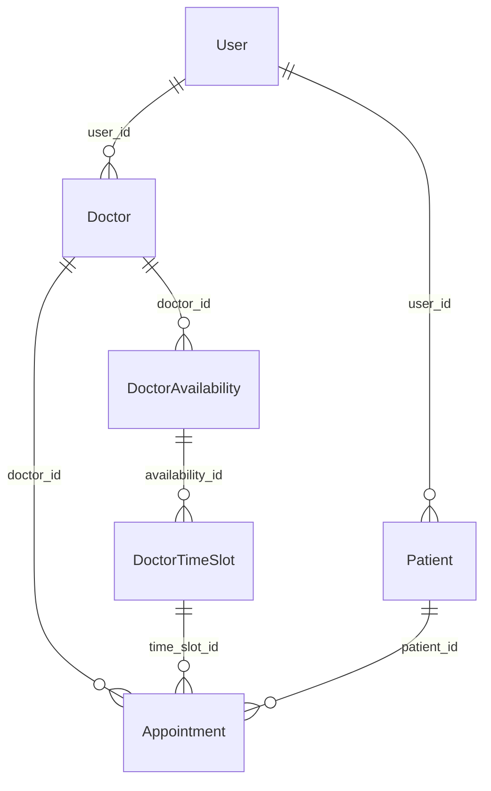

# 🏥 Schedula - Doctor Appointment Booking System

A comprehensive, enterprise-grade doctor appointment booking system backend built with **NestJS**, **TypeORM**, and **PostgreSQL**. The system features advanced scheduling operations, JWT-based authentication, role-based access control, and intelligent appointment management.

## 🚀 Live Demo

- **🔗 Deployed Backend**: [https://pearlthoughts-backend-internship.onrender.com](https://pearlthoughts-backend-internship.onrender.com)
- **📂 GitHub Repository**: [github.com/Niketan2004/PearlThoughts-Backend-Internship](https://github.com/Niketan2004/PearlThoughts-Backend-Internship)
- **📋 Postman Collection**: Available in the repository root

## 📋 Table of Contents

- [Features](#-features)
- [Technology Stack](#-technology-stack)
- [System Architecture](#-system-architecture)
- [Database Schema](#-database-schema)
- [API Endpoints](#-api-endpoints)
- [Installation & Setup](#-installation--setup)
- [Environment Configuration](#-environment-configuration)
- [API Testing with Postman](#-api-testing-with-postman)
- [Usage Examples](#-usage-examples)
- [Advanced Features](#-advanced-features)
- [Project Structure](#-project-structure)
- [Contributing](#-contributing)

## ✨ Features

### 🔐 Authentication & Authorization
- **JWT-based Authentication** with secure token management
- **Role-based Access Control** (Doctor, Patient)
- **Password Encryption** using bcrypt
- **Session Management** with token expiration

### 👨‍⚕️ Doctor Management
- **Profile Management** with medical credentials
- **Availability Setting** with flexible scheduling
- **Time Slot Management** with capacity control
- **Advanced Rescheduling** operations

### 👤 Patient Management
- **Patient Registration** with medical history
- **Profile Management** with personal information
- **Appointment History** tracking
- **Medical Records** management

### 📅 Appointment System
- **Smart Booking** with availability validation
- **Real-time Slot Status** tracking
- **Cancellation Management** with status updates
- **Unified Rescheduling API** with multiple operation types

### 🔄 Advanced Scheduling Operations
- **Slot-to-Slot Movement**: Direct appointment transfers
- **Time Shift Operations**: Bulk time adjustments
- **Schedule Shrinking**: Comprehensive schedule reduction
- **Capacity Management**: Real-time slot availability tracking

## 🛠 Technology Stack

| Category | Technology |
|----------|------------|
| **Backend Framework** | NestJS with TypeScript |
| **Database** | PostgreSQL |
| **ORM** | TypeORM |
| **Authentication** | JWT (JSON Web Tokens) |
| **Validation** | class-validator, class-transformer |
| **Security** | bcrypt for password hashing |
| **API Documentation** | Postman Collection |
| **Deployment** | Render.com |

## 🏗 System Architecture

### Core Modules

```
📦 Schedula Backend
├── 🔐 Auth Module (JWT Authentication)
├── 👨‍⚕️ Doctor Module (Profile & Scheduling)
├── 👤 Patient Module (Profile Management)
├── 📅 Appointment Module (Booking & Management)
└── 🛠 Common Module (Utilities & Guards)
```

### Database Entities

- **Users**: Base authentication entity
- **Doctors**: Medical professional profiles
- **Patients**: Patient information and medical history
- **DoctorAvailability**: Doctor schedule and availability
- **DoctorTimeSlot**: Individual time slots with capacity
- **Appointments**: Booking records and status

## 🗄 Database Schema

### Entity Relationships



### Key Tables

| Table | Purpose |
|-------|---------|
| `users` | Base user authentication and profile |
| `doctors` | Doctor-specific profile and credentials |
| `patients` | Patient medical information |
| `doctor_availabilities` | Doctor schedule definitions |
| `doctor_time_slots` | Individual bookable time slots |
| `appointments` | Appointment bookings and status |

## 🔌 API Endpoints

### 🔐 Authentication Endpoints
```http
POST   /api/auth/patient/register     # Patient registration
POST   /api/auth/doctor/register      # Doctor registration
POST   /api/auth/login                # User login (both roles)
POST   /api/auth/logout               # User logout
```

### 👨‍⚕️ Doctor Endpoints
```http
GET    /api/doctors                   # Get all doctors (public)
GET    /api/doctors/:id               # Get doctor profile (public)
PATCH  /api/doctors/:id               # Update doctor profile (auth)
POST   /api/doctors/:id/availability  # Create availability (auth)
GET    /api/doctors/:id/slots         # Get doctor time slots
POST   /api/doctors/:id/slots         # Create time slots (auth)
DELETE /api/doctors/:id/slots/:slotId # Delete time slot (auth)
POST   /api/doctors/:doctorId/reschedule # Unified scheduling operations (auth)
```

### 👤 Patient Endpoints
```http
GET    /api/patients/:id              # Get patient profile (auth)
PATCH  /api/patients/:id              # Update patient profile (auth)
```

### 📅 Appointment Endpoints
```http
GET    /api/v1/appointments           # Get appointments (auth)
POST   /api/v1/appointments/new       # Book new appointment (auth)
PATCH  /api/v1/appointments/:id/cancel # Cancel appointment (auth)
PATCH  /api/v1/appointments/reschedule # Reschedule appointment (auth)
```

## 🚀 Installation & Setup

### Prerequisites
- **Node.js** (v16 or higher)
- **PostgreSQL** (v12 or higher)
- **npm** or **yarn**

### Local Development Setup

1. **Clone the Repository**
   ```bash
   git clone https://github.com/Niketan2004/PearlThoughts-Backend-Internship.git
   cd PearlThoughts-Backend-Internship/doctor-appointment-booking
   ```

2. **Install Dependencies**
   ```bash
   npm install
   ```

3. **Environment Setup**
   ```bash
   cp .env.example .env
   # Edit .env with your database credentials
   ```

4. **Database Setup**
   ```bash
   # Create PostgreSQL database
   createdb schedula_db
   
   # Run migrations
   npm run migration:run
   ```

5. **Start Development Server**
   ```bash
   npm run start:dev
   ```

The server will start on `http://localhost:3000`

### Production Deployment

The application is deployed on **Render.com** with automatic deployments from the GitHub repository.

## ⚙️ Environment Configuration

Create a `.env` file in the project root:

```bash
# Database Configuration
DB_HOST=localhost
DB_PORT=5432
DB_USERNAME=your_postgres_username
DB_PASSWORD=your_postgres_password
DB_DATABASE=schedula_db

# Application Configuration
NODE_ENV=development
PORT=3000

# JWT Configuration
JWT_SECRET=your-super-secret-jwt-key-change-this-in-production
JWT_EXPIRES_IN=24h
```

### Production Environment Variables

For Render deployment, set these environment variables:

```bash
DB_HOST=your_render_postgres_host
DB_PORT=5432
DB_PGUSERNAME=your_render_postgres_username
DB_PGPASSWORD=your_render_postgres_password
DB_DATABASE=your_render_database_name
NODE_ENV=production
PORT=3000
JWT_SECRET=your_production_jwt_secret
JWT_EXPIRES_IN=24h
```

## 📋 API Testing with Postman

### Import Collection

1. **Download the Postman Collection**
   - File: `Schedula - Doctor Appointment Booking API Copy.postman_collection.json`
   - Located in the repository root

2. **Import to Postman**
   - Open Postman
   - Click "Import" → "Upload Files"
   - Select the collection file

3. **Configure Environment**
   - Create new environment in Postman
   - Set base URL: `https://pearlthoughts-backend-internship.onrender.com` (production)
   - Or: `http://localhost:3000` (local development)

### Authentication Flow

1. **Register a Patient**
   ```json
   POST /api/auth/patient/register
   {
     "full_name": "John Doe",
     "email": "john@example.com",
     "password": "password123",
     "phone": "1234567890"
   }
   ```

2. **Register a Doctor**
   ```json
   POST /api/auth/doctor/register
   {
     "full_name": "Dr. Jane Smith",
     "email": "doctor@example.com",
     "password": "password123",
     "phone": "9876543210",
     "education": "MBBS, MD",
     "specialization": "Cardiology",
     "experience_years": 10,
     "clinic_name": "Heart Care Clinic",
     "clinic_address": "123 Medical Street"
   }
   ```

3. **Login**
   ```json
   POST /api/auth/login
   {
     "email": "john@example.com",
     "password": "password123"
   }
   ```

4. **Use JWT Token**
   - Copy the token from login response
   - Set as Bearer Token in Authorization header
   - Use for all authenticated endpoints

## 💡 Usage Examples

### Creating Doctor Availability

```json
POST /api/doctors/{doctorId}/availability
Authorization: Bearer {jwt_token}

{
  "date": "2024-01-15",
  "consulting_start_time": "09:00",
  "consulting_end_time": "17:00",
  "session": "FULL_DAY",
  "booking_start_at": "2024-01-10T00:00:00Z",
  "booking_end_at": "2024-01-14T23:59:59Z"
}
```

### Creating Time Slots

```json
POST /api/doctors/{doctorId}/slots
Authorization: Bearer {jwt_token}

{
  "availability_id": 1,
  "start_time": "09:00",
  "end_time": "09:30",
  "max_patients": 1
}
```

### Booking an Appointment

```json
POST /api/v1/appointments/new
Authorization: Bearer {jwt_token}

{
  "time_slot_id": 1,
  "reason": "Regular checkup",
  "notes": "Annual health examination"
}
```

### Unified Rescheduling Operations

#### Slot-to-Slot Movement
```json
POST /api/doctors/{doctorId}/reschedule
Authorization: Bearer {jwt_token}

{
  "operation_type": "SLOT_TO_SLOT",
  "appointment_ids": [1, 2],
  "target_slot_id": 5
}
```

#### Time Shift Operation
```json
POST /api/doctors/{doctorId}/reschedule
Authorization: Bearer {jwt_token}

{
  "operation_type": "TIME_SHIFT",
  "appointment_ids": [1, 2, 3],
  "shift_minutes": 30
}
```

#### Schedule Shrinking
```json
POST /api/doctors/{doctorId}/reschedule
Authorization: Bearer {jwt_token}

{
  "operation_type": "SCHEDULE_SHRINKING",
  "shrink_type": "BOTH_END",
  "shrink_minutes": 60,
  "availability_ids": [1, 2]
}
```

## 🔥 Advanced Features

### 1. First-Come-First-Serve (FCFS) System
- **Automatic Capacity Management**: Real-time slot status updates
- **Booking Window Validation**: Prevents last-minute bookings
- **Conflict Resolution**: Handles double-booking attempts

### 2. Unified Rescheduling API
- **Parameter-driven Operations**: Single endpoint for multiple operations
- **Transaction Safety**: Database-level consistency
- **Bulk Operations**: Handle multiple appointments simultaneously

### 3. Smart Status Management
- **Automatic Status Updates**: Based on capacity and bookings
- **Real-time Availability**: Live slot status tracking
- **Cascade Operations**: Related entity updates

### 4. Role-based Security
- **JWT Authentication**: Secure token-based auth
- **Route Guards**: Endpoint-level protection
- **Role Validation**: Operation-specific permissions

## 📁 Project Structure

```
doctor-appointment-booking/
├── 📄 README.md
├── 📄 package.json
├── 📄 .env.example
├── 📄 nest-cli.json
├── 📄 tsconfig.json
├── 📁 src/
│   ├── 📄 main.ts                 # Application entry point
│   ├── 📄 app.module.ts           # Root module
│   ├── 📄 data-source.ts          # TypeORM configuration
│   ├── 📁 auth/                   # Authentication module
│   │   ├── 📄 auth.controller.ts
│   │   ├── 📄 auth.service.ts
│   │   ├── 📄 auth.module.ts
│   │   ├── 📁 dto/                # Data transfer objects
│   │   ├── 📁 entities/           # User entity
│   │   ├── 📁 guards/             # Auth guards
│   │   └── 📁 strategies/         # JWT strategy
│   ├── 📁 doctors/                # Doctor management
│   │   ├── 📄 doctor.controller.ts
│   │   ├── 📄 doctor.service.ts
│   │   ├── 📄 doctor.module.ts
│   │   ├── 📁 dto/                # Doctor DTOs
│   │   ├── 📁 entities/           # Doctor entities
│   │   ├── 📁 enums/              # Doctor enums
│   │   └── 📁 services/           # Schedule service
│   ├── 📁 patients/               # Patient management
│   │   ├── 📄 patient.controller.ts
│   │   ├── 📄 patient.service.ts
│   │   ├── 📄 patient.module.ts
│   │   ├── 📁 dto/                # Patient DTOs
│   │   └── 📁 entities/           # Patient entity
│   ├── 📁 appointments/           # Appointment system
│   │   ├── 📄 appointment.controller.ts
│   │   ├── 📄 appointment.service.ts
│   │   ├── 📄 appointment.module.ts
│   │   ├── 📁 dto/                # Appointment DTOs
│   │   ├── 📁 entities/           # Appointment entity
│   │   └── 📁 enums/              # Status enums
│   ├── 📁 common/                 # Shared utilities
│   │   └── 📁 utils/              # Time utilities
│   └── 📁 migrations/             # Database migrations
├── 📁 test/                       # Test files
└── 📄 Schedula - Doctor Appointment Booking API Copy.postman_collection.json
```

## 🔧 Available Scripts

```bash
# Development
npm run start:dev          # Start development server with hot reload
npm run start:debug        # Start with debug mode

# Production
npm run build              # Build for production
npm run start:prod         # Start production server

# Database
npm run migration:generate # Generate new migration
npm run migration:run      # Run migrations
npm run migration:revert   # Revert last migration

# Testing
npm run test               # Run unit tests
npm run test:e2e           # Run end-to-end tests
npm run test:cov           # Run tests with coverage

# Code Quality
npm run lint               # Run ESLint
npm run format             # Format code with Prettier
```


---

<div align="center">

**🏥 Schedula - Making Healthcare Accessible** 


[🔗 Live Demo](https://pearlthoughts-backend-internship.onrender.com) | [📂 GitHub](https://github.com/Niketan2004/PearlThoughts-Backend-Internship) | [📋 API Collection](./Schedula%20-%20Doctor%20Appointment%20Booking%20API%20Copy.postman_collection.json)

</div>
